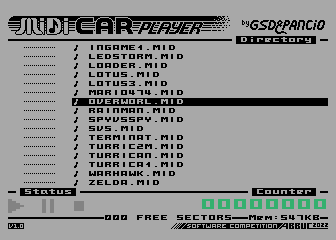
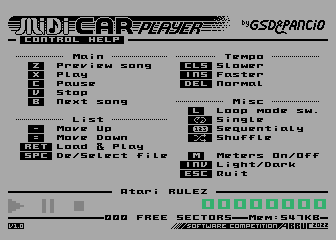
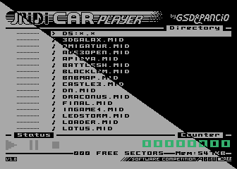

**MIDICar Player** is a MID files player and was created in cooperation with **MIDICar** interface creator (*Błażej "Pancio" Biernat*) to be connected to CART/ECI or PBI connector of 8-bit Atari.

The player automatically detects if **MIDICar** is connected to the computer and if not it simply won't start. The situation is similar for **Axlon** type memory extensions and for **SDX operating system** for which a separate player version is being developed.

The program offers simple interface and intuitive operation from the computer keyboard. Most of the control is done with `arrow keys` and the `Return` key. A help screen is also available, which is displayed by pressing the `H` key.

The layout of the playback controls are taken from WinAMP and are respectively:

- `X` - Play
- `C` - Pause
- `V` - Stop
- `Z` and `B` - for changing the track Previous and Next respectively.

A word of explanation is needed for these last two functions. They only work in looping mode **123** and **Shuffle**.

The looping mode can be changed with the `L` key and is done sequentially:

- Single track,
- One track in loop,
- Entire list in loop (123)
- and Shuffle.

The `SPACE` key gives the option to unhook from the track list. These will be skipped in "123" and Shuffle modes, and when switching tracks with the `Z` and `V` keys.

It is possible to change the speed of the track being played. Using the `<`, `>` keys which decrease and increase the playback speed respectively, and 'Back Space' which restores the original speed of the song.

You can also change the colour scheme of the player from light to dark with the `INVERS` key.

The `M` key can be used to turn off the channel volume preview, which can have some effect on song playback.

Exit the program by pressing the `ESC` key - the program does not confirm this operation.

---

Minimum requirements:
- 64KB of RAM, where approximately 35KB will be available per song, hence memory expansion to at least 128KB is recommended
- the program only supports PORTB-based extensions, e.g. Compy, Rambo, U1MB.
- DOS MEMLO must be below $2000
- no use of RAM under ROM and extended memory - data placed in RAM disks may be destroyed!

